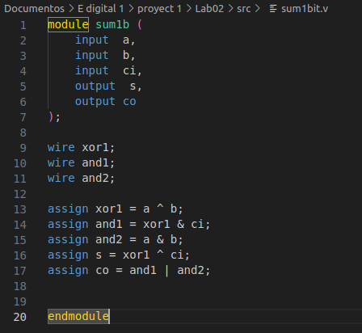
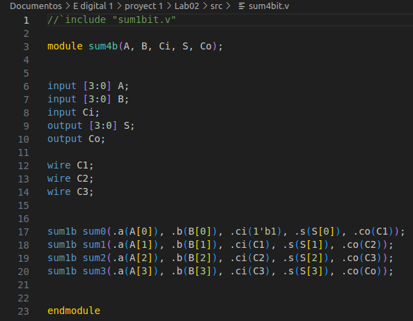
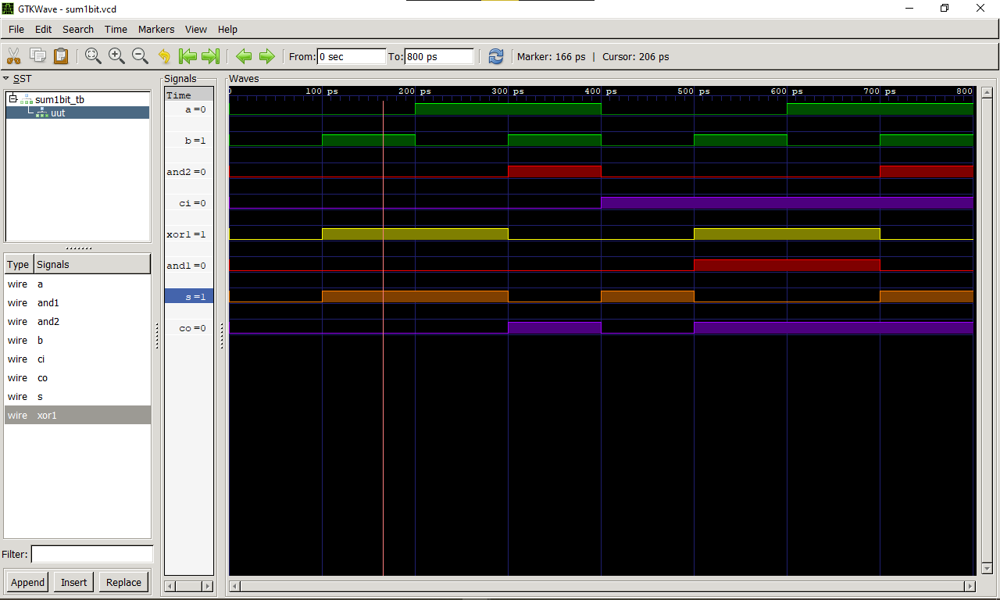
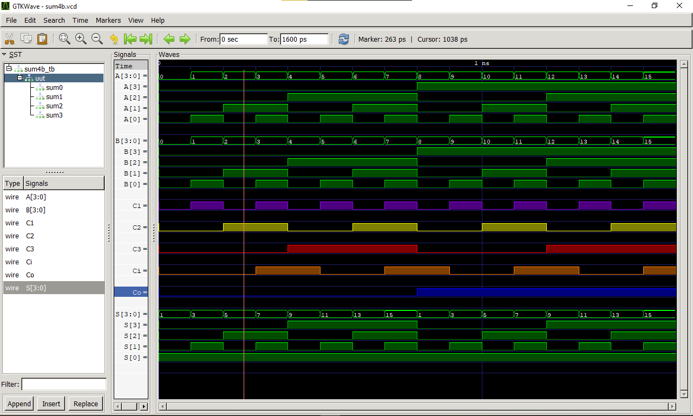

# Laboratorio 2

## Regla udev para el USB-blaster de la FPGA

Seguimos los pasos muy cuidadosamente e incluso con la ayuda del profesor. Una vez seguido estos pasos, la regla udev debería permitir el acceso al USB-Blaster . Ahora se pudo intentar reconectar el USB-Blaster y verificar su funcionamiento correctamente.

## Implementación del sumador de 1 bit para instanciar uno de 4 bits

Definimos un sumador de 1 bit y luego utilizamos cuatro instancias de este sumador de 1 bit para construir un sumador de 4 bits.

Pasos:

1. Definimos el sumador de 1 bit (sum1b) con las entradas a, b y ci, y las salidas s y co.
2. Luego, instanciaste cuatro copias de este sumador de 1 bit (sum1b) en tu sumador de 4 bits (sum4b). Cada instancia toma las entradas correspondientes de los bits de A y B, así como la salida ci de la instancia anterior y proporciona la salida s correspondiente para el bit correspondiente de la suma, y una salida co que se propaga al siguiente sumador.

## Anexos de entregables del laboratorio 2

### Videos de funcionamiento

- [Video del sumador de 1 bit](https://youtu.be/z3Zq9_oTAwk)
- [Video del sumador de 4 bits](https://youtu.be/BzLvn75Jiqs)

### Imágenes

1. Sumador de 1 bit,
- 

2. sumador de 4 bit.
- 

### Capturas de pantalla de la simulación

1. Simulación de la suma de 1 bit
   

   Para la simulación del sumador de 1 Bit podemos ver el estado [1 o 0] para cada una de las entradas, las compuertas, los carry y las salidas del sumador donde:

   * Verde para las entradas *a* y *b*.
   * Amarillo para la compuerta XOR (XOR entre a y b).
   * Rojo para las compuertas *and* (And1:entre XOR y Carry de entrada. And2: entre a y b).
   * Morado tanto para carry de salida como la salida misma.

2. Simulacion de la suma de 4 bit
- 

Para la simulación del sumador de 4 Bits podemos ver el lo siguiente

   * Verde estado [1 o 0] para cada una de las entradas A y B individuales (sombreado) aligual que la y las salidas, y a su vez una vista compacta y general con valores decimales con los que podríamos corroborar la suma.
   * Anaranjado para el Carry de entrada.
   * Morado, amarillo y rojo para el Carry 1, 2 y 3, respectivamente.
   * Azul para el carry de salida.

