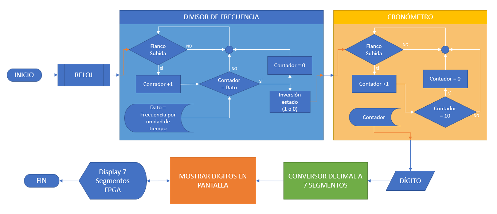
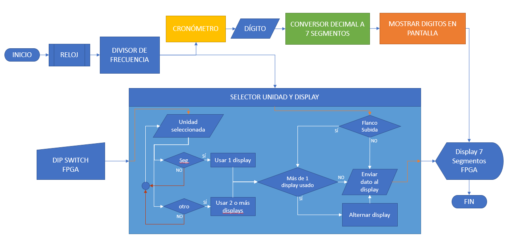
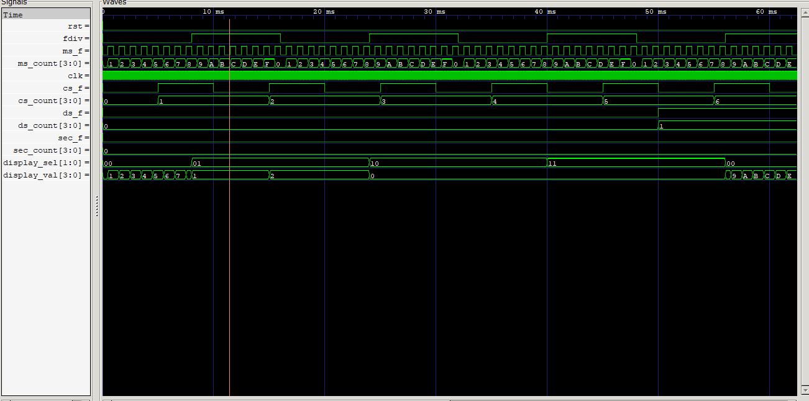

# Laboratorio 4
# Lab 04: Contador de segundos, décimas y centésimas de segundos

## Descripción del Proyecto

En este proyecto, implementamos un contador para medir y mostrar segundos, décimas de segundo, centésimas de segundo y milésimas de segundo en un display de 7 segmentos. Usamos la tarjeta de desarrollo Altera A-C4E6E10 con FPGA Cyclon IV.

El sistema cuenta con dos switches que permiten elegir entre los diferentes modos de conteo y un botón de reset para reiniciar el contador a cero.

## Componentes Clave

### Divisor de Frecuencia

Este módulo toma la señal de reloj de la FPGA y la divide para generar diferentes señales de tiempo: milisegundos, centisegundos, decisegundos y segundos. Estas señales son cruciales para el funcionamiento de los contadores.

### Contadores

Usamos registros para contar las diferentes unidades de tiempo. Estos contadores se incrementan basados en las señales generadas por el divisor de frecuencia.

### Display de 7 Segmentos

El display muestra los valores de los contadores. Usamos multiplexado para alternar entre los displays y mostrar diferentes valores de tiempo según el modo seleccionado por los switches.

## Código

### freq_div.v

Este es el código del divisor de frecuencia. Genera señales de diferentes frecuencias que usamos para contar milisegundos, centisegundos, decisegundos y segundos.

### crono.v
Este es el módulo principal. Instancia el divisor de frecuencia y usa sus señales para contar el tiempo. También maneja el multiplexado de los displays y la conversión de los contadores a la codificación de 7 segmentos.

### Testbench
Para verificar el funcionamiento del sistema, creamos un testbench que simula el comportamiento del módulo Crono y genera un archivo .vcd para visualizar en GTKWave. El testbench asegura que todos los contadores funcionan correctamente y que los displays muestran los valores correctos.

## Simulación y Resultados
Realizamos simulaciones exhaustivas para verificar el funcionamiento del contador en todas las unidades de tiempo. Usamos Icarus Verilog para compilar y ejecutar la simulación, y GTKWave para visualizar los resultados.

### Pasos de la Simulación
 #### Inicialización: Configuramos el reloj y el reset.
 #### Contadores: Observamos el conteo de milisegundos, centisegundos, decisegundos y segundos.
 #### Cambio de Modo: Cambiamos entre los modos de conteo usando los switches y verificamos que los displays muestren los valores correctos.
 ####  Resultados Obtenidos
Aquí están algunos pantallazos de la simulación en GTKWave:

Los resultados muestran que todos los contadores funcionan correctamente y que los displays muestran los valores esperados en cada modo de operación. La simulación confirma que el sistema funciona como se esperaba, contando correctamente en milisegundos, centisegundos, decisegundos y segundos.

## Conclusión
 Implementamos un contador de tiempo que puede mostrar segundos, décimas, centésimas y milésimas de segundo en un display de 7 segmentos. La simulación confirmó que el sistema funciona correctamente en todos los modos de operación. ¡Un proyecto divertido y educativo!
