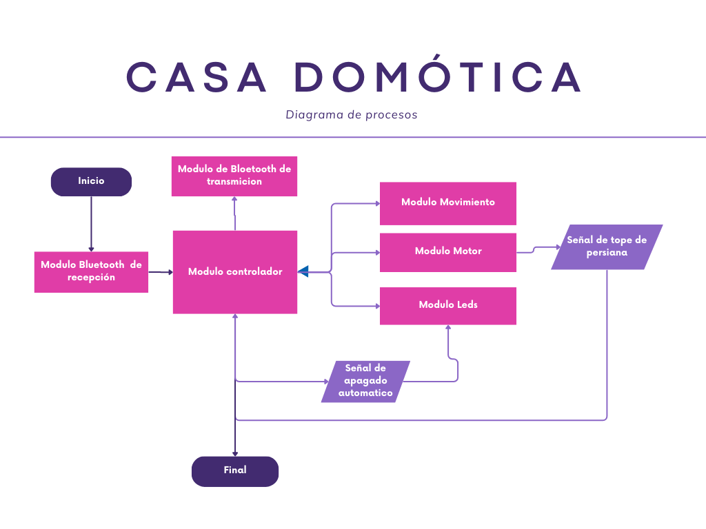
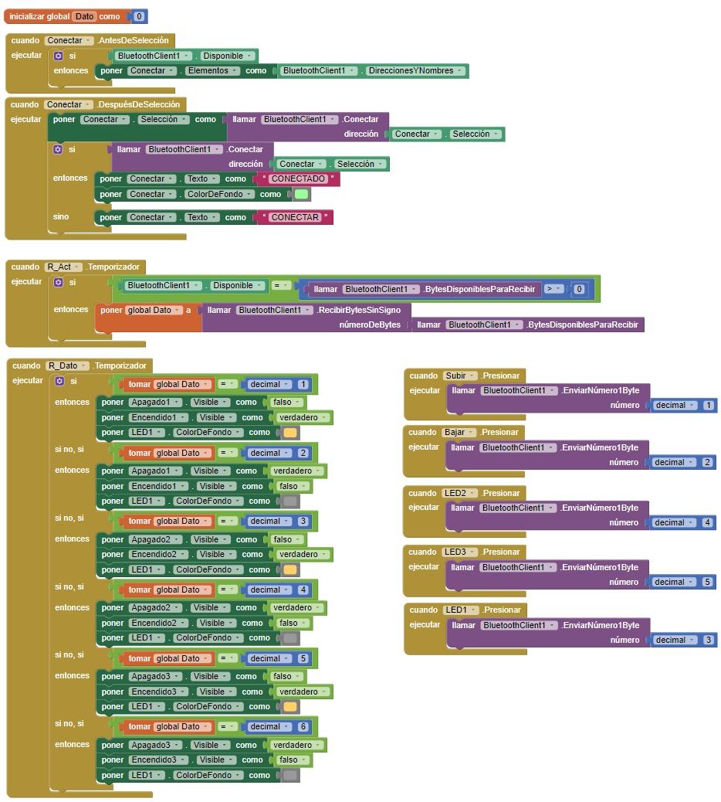
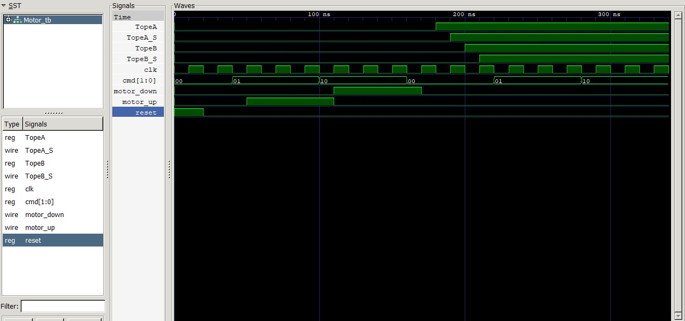
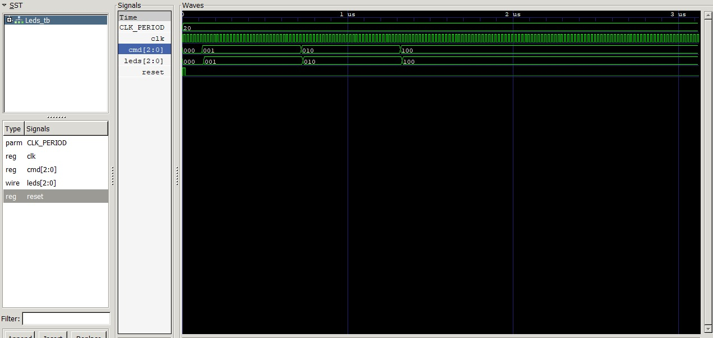
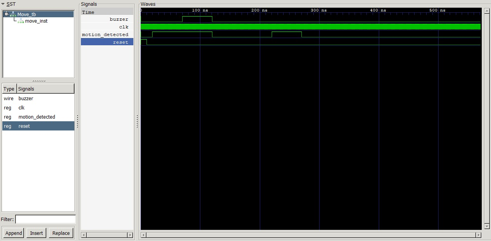
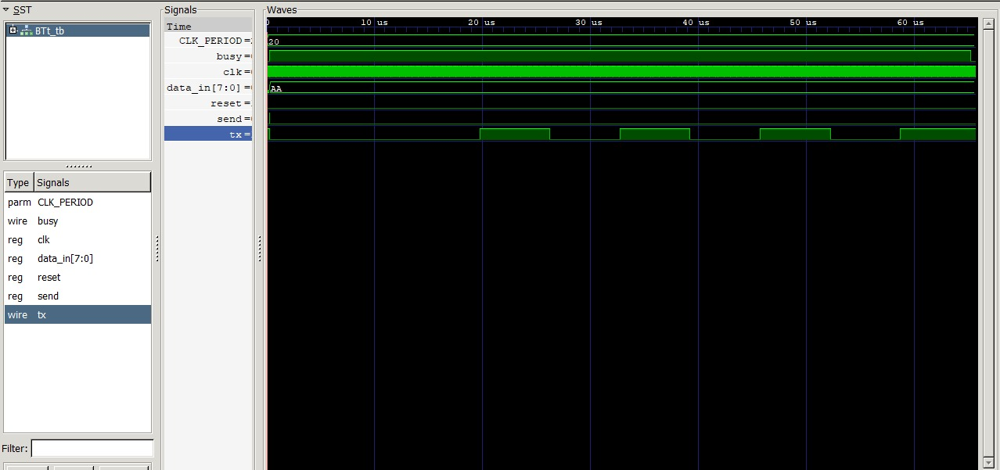
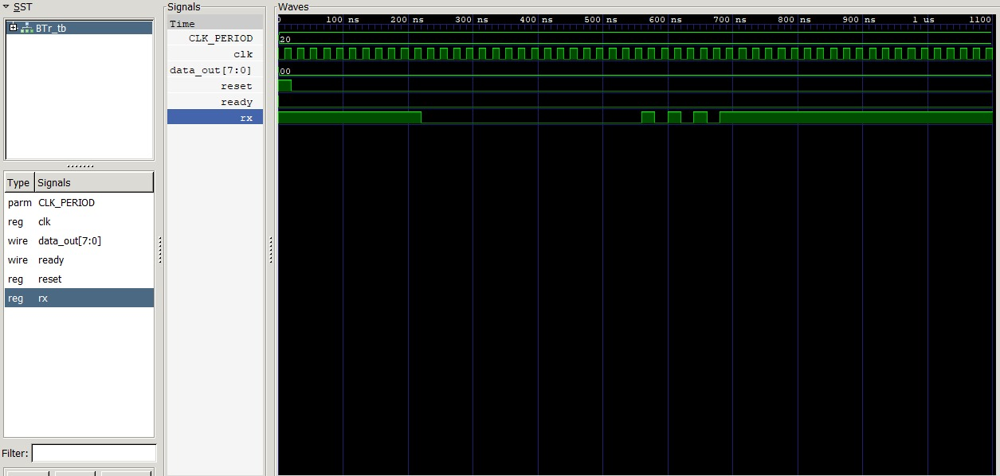

# Proyecto Final Electronica-Digital-1.

## Prototipo de seguridad hogar inteligente

Para la elaboracion del proyecto se escogio en mutuo acuerdo con mi compañero y yo la segunda opcion de las cuatros predispuestas por el profesor (Prototipo de seguridad de casa inteligente) los cuales los requerimientos y los objetivos del proyecto los pueden encontrar en:
*https://github.com/jharamirezma/Electronica-digital-1-2024-1/blob/main/Laboratorios/Proyecto/Proyecto.md#2-prototipo-de-control-y-seguridad-hogar-inteligente*.

Se utilizaron los siguientes componentes electronicos:

- Modulo bluethooth.
- Sensor de movimiento SR602.
- Leds.
- Circuito integrado L293D.
- Miniprotoboard.
- Moto vibrador miniatura.
  
El proceso de fabricacion se comenzo haciendo con una lluvia de ideas la cual se obtuvo como resultado la estructura general del proyecto, y los modulos los cuales se iban a utilizar, por consiguiente dividimos el trabajo por modulo ya que se iba a obtener mayor eficiencia del trabajo, pero por el contrario no se obtuvo un buen rendimiento individual por complicaciones en la delegacion del proyecto.

Al diseñar el circuito del motor se encontro un error en la alimentacion ya que la tarjeta brinda la tension necesaria para el motor escogido al principio del proyecto(necesita 8 V para un correcto funcionamiento) por lo cual se decidio escoger un circuito subsecuente el cual iba contener dos relés uno para cada direccion este iba a tener una alimentacion aparte brindada por una pila de 9 V. Antes de probar su funcionamiento verificamos si teoricamente se iba hacer una buena interconeccion entre la FPGA y los reles haciendo esta prueba se encontro que los relés debian ser del mismo valor de la alimentacion que nos brinda la salida de la FPGA en este caso 3V se intento conseguir de ese valor pero desafortunadamente no era un valor comercial, La solucion para ello fue cambiar de motor a un moto vibrador miniatura el cual funciona a la perfeccion con los 3 V de la tarjeta FPGA.

### Diagrama de procesos

En la anterior imagen se detalla el funcionamiento del proyecto en un esquema de bloques en el cual explicare con mas brevedad.

- Modulo Controlador (House.v.): Es el encargado de recibir las tareas y redistribuirlas en los diferentes modulos.
- Modulo Bluethooth Recepcion (BTr.v.): Es el encargado de recibir los datos desde la aplicacion a la FPGA y transmitirlo al modulo controlador.
- Modulo Bluethooth Transmicion (BTt.v.): Es la que transmite la informacion de la tarjeta FPGA a la aplicacion para saber los estados de los leds y de que ha llegado a un tope de los dos extremos.
- Modulo Motor (Motor.v.): Recibe la Señal del modulo controlador el cual le ordenara girar a la izquierda o a la derecha depende de los datos recibidos.
- Modulo leds (Leds.v.): Recibe ordenes de encendidos o apagados con diferentes secuencias para asi prender con un orden especifico los leds.
- Modulo Movimiento (Move.v.): Detecta movimiento el cual activara una señal que se enviara a la tarjeta FPGA para asi activar un buzzer (actua como intermediario).

Para verificar la ejecucion del codigo se elaboro una aplicacion android con los plugins necesarios para emular el funcionamiento del proyecto por ejemplo en la interfaz del motor hay dos botones los cuales se utilizaran para subir y bajar persianas, en la interfaz de los leds hay tres botones correspondiendo cada uno a un led para asi poder encenderlo. La logica que se utilizo para la aplicacion se demuestra en la siguiente imagen.

### Simulaciones

#### Modulo Motor:

#### Modulo Leds:

#### Modulo Move:

#### Modulo De Bluethooth transmision:

#### Modulo De Bluethooth recepcion:

